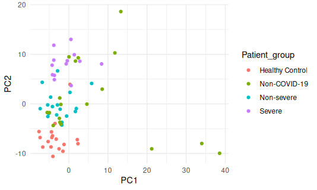
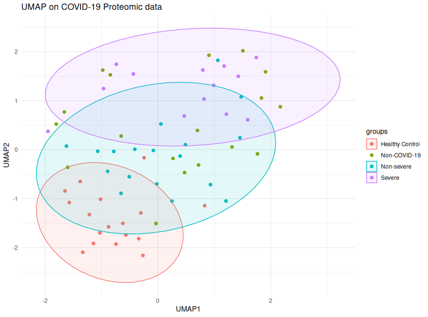
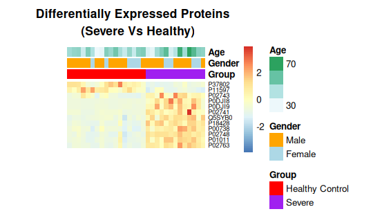

# COVID-19 Serum Proteomic Profile Analysis 

This project explores the relationship between serum proteomic profiles and disease severity in COVID-19 patients. 
Using dimensionality reduction and clustering techniques, the analysis identifies key protein biomarkers that distinguish severe cases from healthy controls.

### Overview
1. **Data Cleaning & Normalization:** preprocessing of clinical metadata and proteomic expression matrices (85% fill-rate filtering).
2. **Clustering** based on patients' serum proteomic profiles: to assess whether these clusters are associated with disease severity (even though severity information is not used during clustering).
3. **Multi-Dimensional Analysis:** Comparison of PCA, t-SNE, and UMAP to visualize patient clustering.
4. **Differential Expression:** Identification of proteins with padj​<0.05 and ∣log2​(FC)∣>1.

### Visual Results
**PCA on the proteomic dataset**

**Patient Clustering (UMAP)**

Observation: Clear separation between Healthy Controls and Severe patients based on their proteomic profile.

**Differential Expression Heatmap**

Top 12 differentially expressed proteins across clinical groups, annotated by Age and Gender.

**Requirements**: library(`readxl`, `tidyverse`, `pheatmap`, `factoextra`, `uwot`, `Rtsne`)

