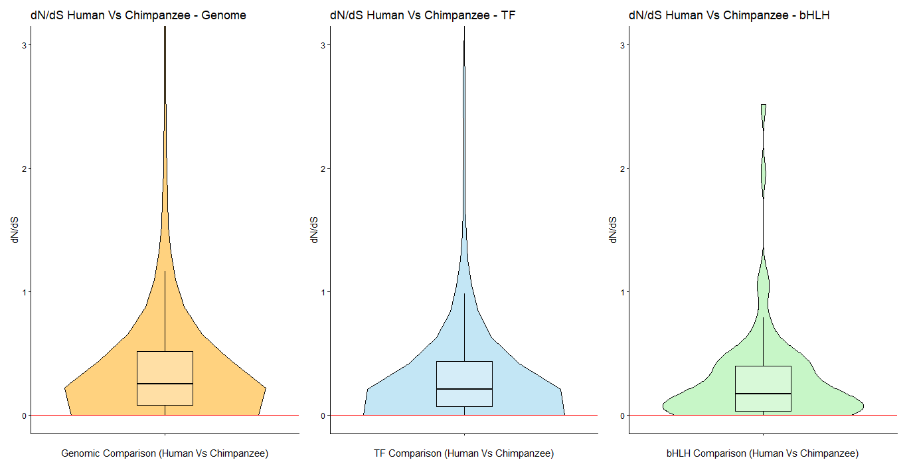

# Evolutionary Rate Analysis through dN/dS ratio

### Goal
This project analyzes the **selecctive pressure** acting on the *Olig2* gene through the ratio of non-synonymous to synonymous substitutions (**dN/dS**), and comparing the *Olig2* value against three reference groups: the human genome, the human transcription factors (TFs) values and the bHLH family genes, using **R**. 

The **dN/dS ratio** has been chosen for this comparison because it informs about the strength and mode of natural selection that act over a coding gene. 
- **dN**: rate of non-synonymous substitutions.
- **dS**: rate of synonymous substitutions.
- **dN/dS < 1**: indicates purifying (negative) selection. 

### Data
**Source**: The data was retrieved from **Ensembl Archives**
- **Version**: Ensembl Gene 77 (Oct 2014). 
- **Dataset**: *Homo sapiens* genes (GRCh38)” 
- **Orthologs**: *Pan troglodytes* (Chimpanzee) and *Mus musculus* (Mouse).

**Evolutionary Context**: Two species were selected as orthologs to assess different evolutionary scales:
- **Chimpanzee** (*Pan troglodytes*): Selected for its genetic proximity to humans.
- **Mouse** (*Mus musculus*): was chosen to assess the selective pressure across a longer evolutionary distance.

**Input Files**: The following raw data files are included in this repository and are required to run the `dN-dS-Analysis.R` script:
- `dN-dS_oct_2014_ortologs_chimpance.txt`: Human vs Chimpanzee ortholog data.
- `dN-dS_oct_2014_ortologs_mouse.txt`: Human vs Mouse ortholog data.
- **TF Reference**: The file `HumanTFs_DBD.txt` is used to identify Ensembl IDs for human transcription factors and the bHLH family. 

### Results and Visualization
The script generates a **violin plot** that shows the distribution of the dN/dS ratio for three groups of genes. The position of the *Olig2* gene was highlighted in the distribution with a **red horizontal line**.

In addition, the pipeline computes:
- **Mean and Median** for each group.
- **Percentile rank** of the *Olig2* gene within each distribution.

| |Species Compared| Gene Group | Mean dN/dS | Median dN/dS | Olig2 Percentile |
|---|---|---|---|---|---|
1 | Human vs Chimp | Genomic | 0.4686020 | 0.25000000 | 16.395719
2 | Human vs Chimp | TF | 0.4484322 | 0.20824830 | 17.188788
3 | Human vs Chimp | bHLH | 0.2802527 | 0.17039106 | 23.595506
4 | Human vs Mouse | Genomic | 0.1828749 | 0.13263016 | 6.712412
5 | Human vs Mouse | TF | 0.1706305 | 0.11410448 | 8.361892
6 | Human vs Mouse | bHLH | 0.1096641 | 0.07428191 | 6.250000

